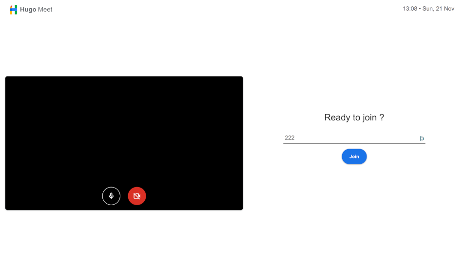

# HugoMeet

This is a project that I made by myself, it's a GoogleMeet plateform like, using **JS**, **REACT** and **WebRTC**.

## Features included:
- **Video/Audio Meeting**
- **Rooms security** *(Required owner approval to join)*
- **Easy to send link** *(Because it's the same url has your's)*

## Containing:
- **Front**, *which is all the client side application*
- **SignallingServer**, *which is the service where clients will be connect to when joining a room. This Server store all the data of the rooms because I was too lazy to create a API and Database :P*
- **setup.sh**, *which is a script to install and launch everything*

## Installation
1. Install NodeJS (https://nodejs.org/en/download/)
2. Clone/Download `git clone https://github.com/hcabel/HugoMeet.git`
3. Go in the reop `cd HugoMeet`
4. Launch the services `sudo ./setup.sh`
5. Open your browser (http://127.0.0.1:3000)

**/!\\ __IF IT DIDN'T WORK CONTINUE__ /!\\**

6. Download pm2 `npm i -g pm2`
7. Go to the front folder `cd front`
8. Install all the packages required `npm i`
9. Start front service `pm2 start npm --Name "HotFront" -- start`
10. Go to the SignallingServer folder `cd ../SignallingServer`
11. Install all the packages required `npm i`
12. Start SignallingServer `pm2 node signallingServer.js`
13. Try your browser again (http://127.0.0.1:3000)

#### Landing Page

#### PreRoom Page

#### Room Page
