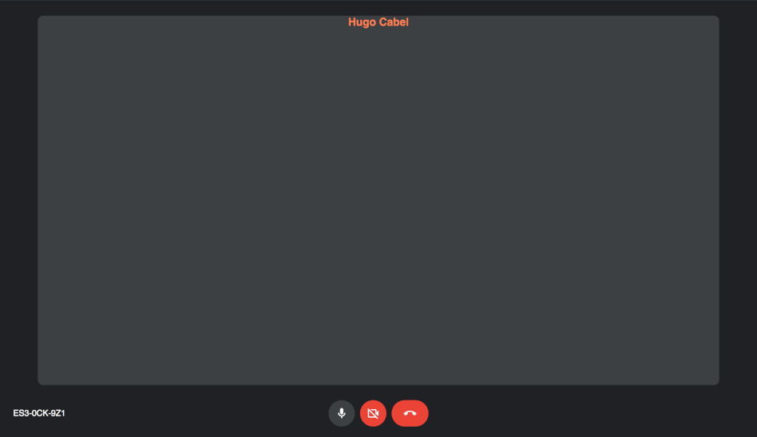

# HugoMeet

This is a personal project that I made by myself, it's a GoogleMeet plateform like, using **JS**, **REACT** and **WebRTC**.

## Features included:
- Video/Audio Meeting
- Rooms security (Required owner approval to join)
- Easy to send link (Because it's the same url has your's)

## Containing:
- *Front*, which is all the client side application
- *SignallingServer*, which is the service where clients will be connect to when joining a room.
    This Server store all the data of the rooms because I was to lazy to create a API and Database :D

## How to use
1. Clone/Download `git clone https://github.com/hcabel/HugoMeet.git`
2. Install NodeJS (https://nodejs.org/en/download/)
3. sudo ./setup.sh
4. Open your browser (http://127.0.0.1:3000)

**/!\\ __IF IT DIDN'T WORK CONTINUE__ /!\\**

5. Download pm2 `npm i -g pm2`
6. Go to the front folder `cd front`
7. Install all the packages required `npm i`
8. Start front service `pm2 start npm --Name "HotFront" -- start`
9. Go to the SignallingServer folder `cd ../SignallingServer`
10. Install all the packages required `npm i`
11. Start SignallingServer `pm2 node signallingServer.js`
12. Try your browser again (http://127.0.0.1:3000)

